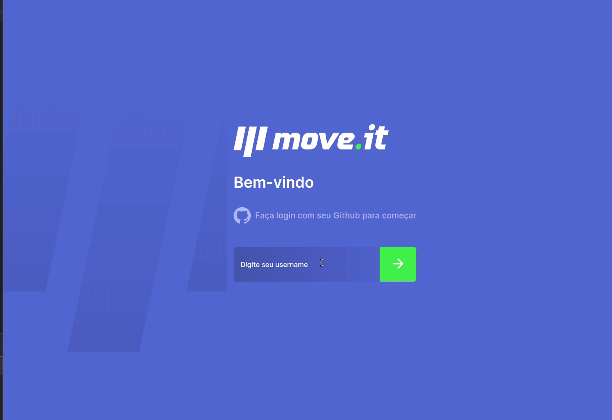

# MoveIt

# Project Preview


# About the project
  This project was developed using [NextJS](https://nextjs.org/) during rocketseat Next Level Week editon 4.

  It is a gamification application that gives exercises (stretching for the body and eyes) that can be done in a short time.

# Installation & Set Up

1. Install project dependencies

```bash
  yarn install or npm install
```

2. Start the development server

```bash
  yarn dev or npm run dev
```
